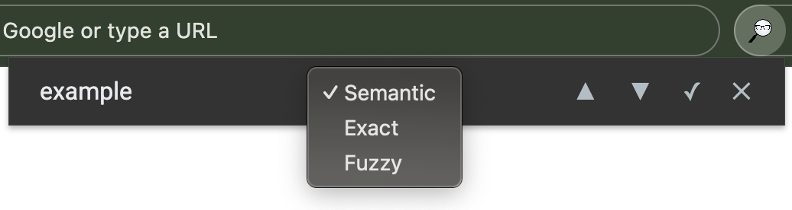
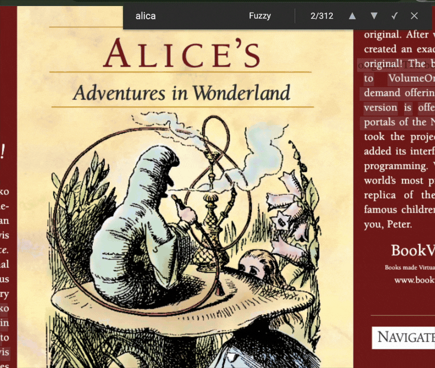

# Browser FZF Search

**Version:** 1.1.0 | **License:** MIT

Browser FZF Search is an AI-powered Chrome extension that enhances web and PDF search capabilities directly in your browser. Leveraging local machine learning with TensorFlow.js and pre-trained GloVe embeddings, it provides fast, privacy-preserving semantic, exact, and fuzzy search functionality without relying on external servers.

## ✨ Features

- **Multi-Mode Search**: Choose between semantic (meaning-based), exact (literal), or fuzzy (approximate) search modes
- **Web & PDF Support**: Seamlessly search across HTML pages and PDFs with a custom viewer
- **Local Processing**: All computation runs client-side using TensorFlow.js with WebGL acceleration
- **Efficient Highlighting**: Matches are visually highlighted with navigation controls for next/previous results
- **Keyboard Shortcuts**: Trigger the popup with `Ctrl+Shift+S` (or `Cmd+Shift+S` on Mac) and navigate matches with `Enter`/`Shift+Enter`
- **Rate Limiting**: Built-in token bucket rate limiter ensures performance stability

## 🚀 Installation

1. **Clone the Repository**
   ``` bash
   git clone https://github.com/zachkepe/google-fzf.git
   ```

2. **Install Dependencies**
   ``` bash
   cd google-fzf && npm install
   ```

3. **Build the Extension**
   ``` bash
   npm run build
   ```

4. **Load into Chrome**
   - Open Chrome and navigate to `chrome://extensions/`
   - Enable "Developer mode" in the top right
   - Click "Load unpacked" and select the `dist/` folder from the project root

## 📝 Usage

- **Open the Popup**: Use `Ctrl+Shift+S` (or `Cmd+Shift+S` on Mac) to launch the search interface
- **Search Modes**: Select from "Semantic," "Exact," or "Fuzzy" via the dropdown
- **Navigate Results**: Use the up/down arrow buttons or `Enter`/`Shift+Enter` to cycle through matches
- **PDF Viewing**: Automatically intercepts `.pdf` URLs and renders them in a searchable viewer

## 🎮 Demonstration

Below are visual examples of the extension in action.

### Search Popup Interface



*The search popup with mode selection and match navigation.*

### Highlighting Matches on a Web Page/PDF



*Highlighting matches on a webpage/PDF with real-time updates.*

## 🔧 Technical Overview

- **Architecture**: Built as a Chrome Manifest V3 extension with a service worker background script, content scripts, and a popup UI
- **Machine Learning**: Utilizes TensorFlow.js with pre-trained GloVe 6B 50D embeddings (15,000-word vocabulary) for semantic search
- **Dependencies**:
  - `@tensorflow/tfjs`: Core ML framework with WebGL backend
  - `fuse.js`: Fuzzy search implementation
  - `pdfjs-dist`: PDF rendering and text extraction
- **Build Tooling**: Webpack with Babel for module bundling and ES6+ compatibility

## 💻 Development

- **Dev Mode**: `npm run dev` (watches for changes and rebuilds)
- **Clean Build**: `npm run clean && npm run build`
- **Embedding Generation**: Run `node scripts/generate-embeddings.js` to regenerate `embeddings.json` from `glove.6B.50d.txt` (optional, pre-built file included)

## 🤝 Contributing

Contributions are welcome! Please:

1. Fork the repository
2. Create a feature branch (`git checkout -b feature/your-feature`)
3. Commit changes (`git commit -m "Add your feature"`)
4. Push to the branch (`git push origin feature/your-feature`)
5. Open a pull request

## 📄 License

This project is licensed under the MIT License. See [LICENSE](LICENSE) for details.

## 📞 Contact

For issues or inquiries, please file a ticket on the [GitHub Issues](https://github.com/zachkepe/google-fzf/issues) page or contact Zach Kepe directly.